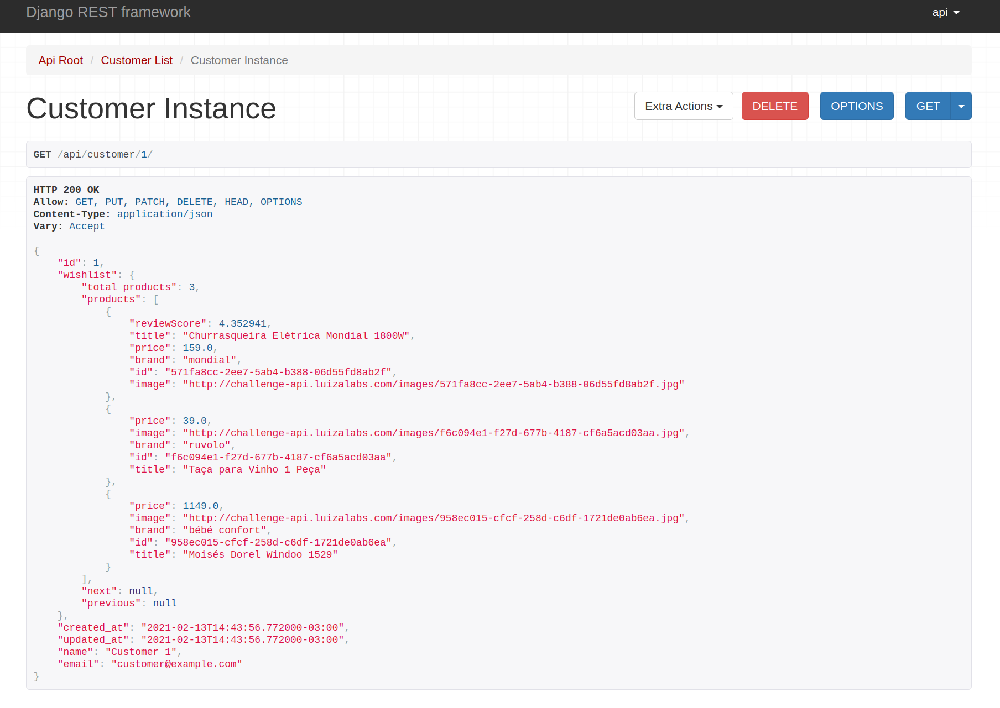

# Wishlist API

## Built With

- [Django](https://www.djangoproject.com/)
- [Django REST framework](https://www.django-rest-framework.org/#)

## Getting Started

To get a local copy up and running follow these simple steps.

### Prerequisites

- [Docker](https://docs.docker.com/get-docker/)
- [docker-compose](https://docs.docker.com/compose/install/)

### Installation

1. Clone the repo

   ```sh
   git clone https://github.com/vitor-kato/wishlist-api.git
   ```

2. Copy the .env.defaults

   ```sh
   cp .env.defaults .env
   ```

3. Use the convenience script to run the project

   ```sh
    ./start_dev.sh
   ```

   > This script can receive all optional args. from docker-compose like:
   >
   > ```sh
   > ./start_dev.sh up --build
   > ```

4. On another shell you can load initial fixtures (to learn more about Django fixtures [click here](https://docs.djangoproject.com/en/3.1/howto/initial-data/) )

   ```sh
    ./start_dev.sh exec api ./manage.py loaddata fixtures/initial_dev
   ```

## Usage

If you loaded the initial fixtures, the user: `api` is on the database with the password: `pass`
Otherwise a user can be created using the shell:

```sh
docker-compose exec api ./manage.py createsuperuser
```

To use the API an authenticated user is required. This project is currently using JWT for this purpose. Using curl:

```sh
curl \
  -X POST \
  -H "Content-Type: application/json" \
  -d '{"username": "api", "password": "pass"}' \
  http://localhost:8000/api/token/


{"refresh":"eyJ0eXAiOi...",
"access":"eyJ0eXAiOi..."}
```

Use the returned access token to acesss protected views:

```sh
curl \
  -H "Authorization: Bearer eyJ0eXAiOi..." \
  http://localhost:8000/api/customer/1/
```

Since this project uses the Django REST framework the browsable API
is available so you type any URL in your browser to see in action:



Adding products to a customer:

```sh
curl \
  -X POST \
  -H "Authorization: Bearer eyJ0eXAiOi..." \
  -H "Content-Type: application/json" \
  -d '{"external_id": "1bf0f365-fbdd-4e21-9786-da459d78dd1f"}' \
  http://localhost:8000/api/customer/1/add-product/
```

Removing products from a customer:

```sh
curl \
  -X POST \
  -H "Authorization: Bearer eyJ0eXAiOi..." \
  -H "Content-Type: application/json" \
  -d '{"external_id": "1bf0f365-fbdd-4e21-9786-da459d78dd1f"}' \
  http://localhost:8000/api/customer/1/remove-product/
```

Pagination to products on responses:

```sh
curl \
  -H "Authorization: Bearer eyJ0eXAiOi..." \
  http://localhost:8000/api/customer/1/?product_page=1&size=10
```

### Postman

Postman documentation is also provided on the `docs/postman` directory
all endpoints are described in there with usage and examples

### Swagger and Redoc

Also provided at the following endpoints:

- `http://localhost:8000/docs/swagger/`
- `http://localhost:8000/docs/redoc/`

### Testing

Tests are using both Django and DRF testing suite.

To run the tests use:

```sh
./start_dev.sh run api ./manage.py test
```
